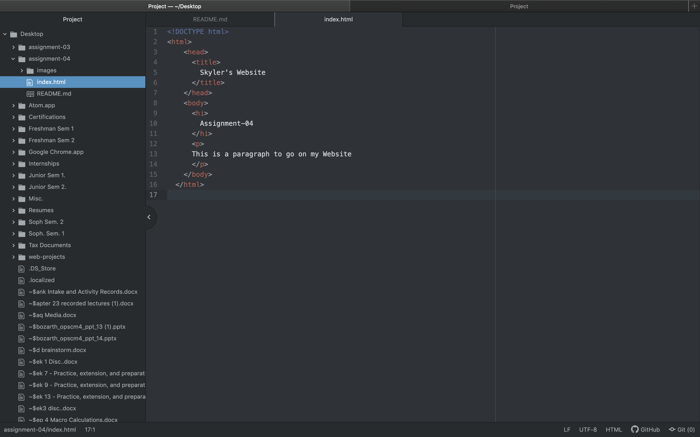

The function of a browser is to display the web resource you wanted. It does this by requesting it from the server and displaying it in the browser window.
I currently only use google chrome on my laptop, and occationally use safari on my phone.

