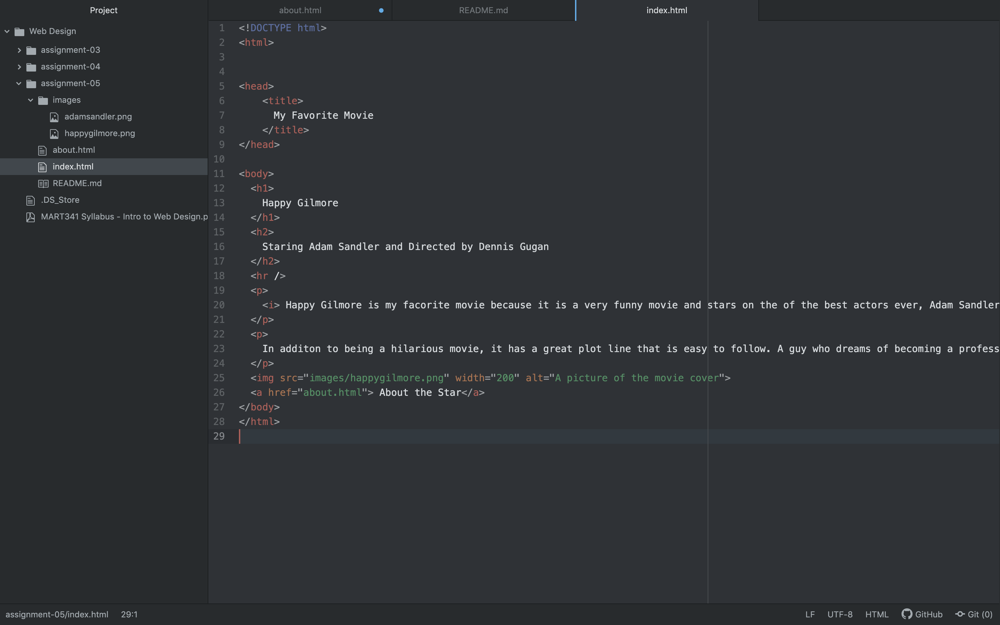

The website I visited on the Wayback Machine was youtube's website. It was from 2005, and looked way different. At the top of the page was a search bar, and then below that was an area to put in what you're looking for by puting in your gender and a category of what you wanted. It did not have a recommended videos page or any other links to different categories as it does with todays site. Overall the website looked way different and was much more difficult to navigate.

