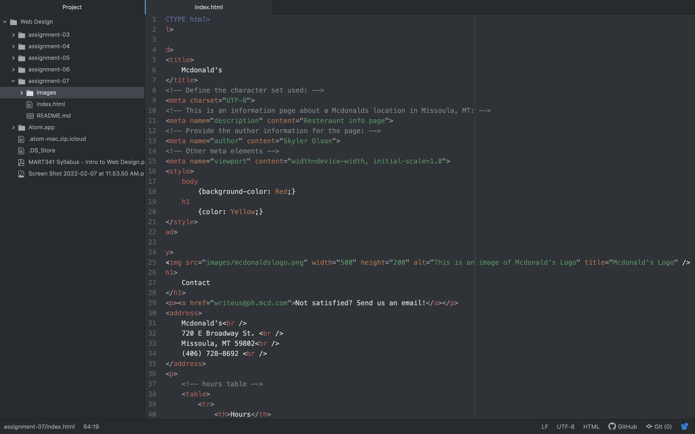

A lot of the forms I see on the web are forms asking to submit your email. A lot of them will say that if you submit your email they will give you a certain percent off your next order. Another form I typically see is a questionare form. A company will post these typically to understand more about their customer, and offer a reward with it. These forms usually have check boxes, lists, and many other things. 

