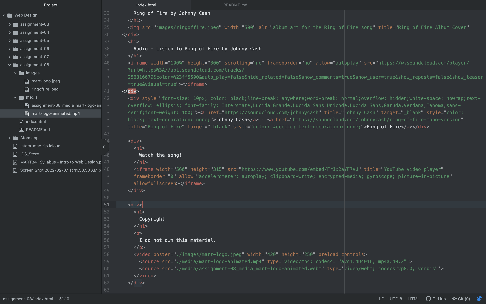

An affordance is what a user can do with an object based on their imagination or capabilities. The advantages to using a third party service for videos is that you don't have to create the content for your website, however if a video gets taken down it will not work on your website, and you cannot have full control the content of the video.
My biggest challenge this week was finding a video that would actually embed on my website. I tried at least 15 different youtube videos, and none of them would work for the song I was trying to do. I know the only way to fix this is by finding a different video but I tried a ton of the ones posted on youtube and none of them would embed properly. I hope it is not too big of an issue for my grade. 

