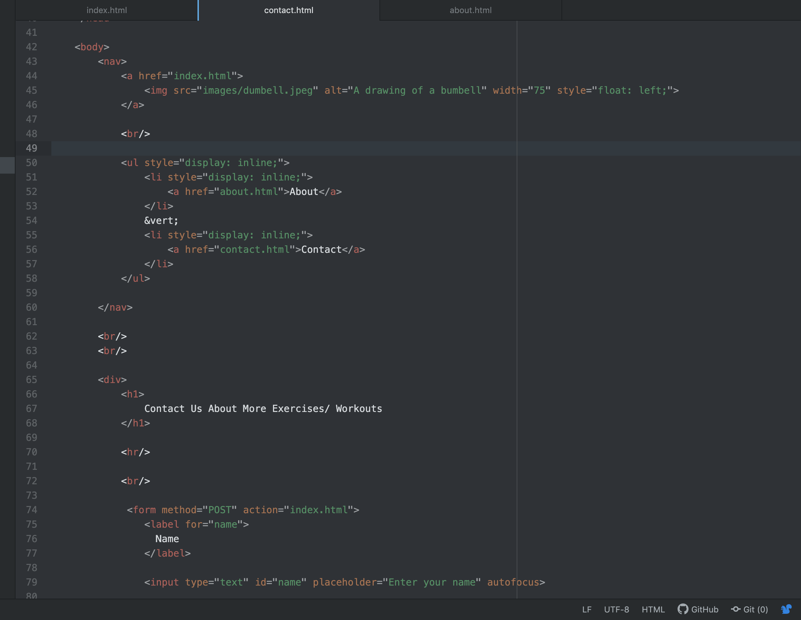

Most of everything we learned in html was new to me. I had never done any html before, but i didn't have too hard of a time figuring it out. Most of the struggles I had was with getting my code to work on the website. A lot of the time i had small errors that prevented it from working properly, but after finding these I was able to solve my issue pretty quickly.
Im a little anxious to start learning a new style in CSS because I might get confused with what I've already learned in html. However I am excited to learn new things!

