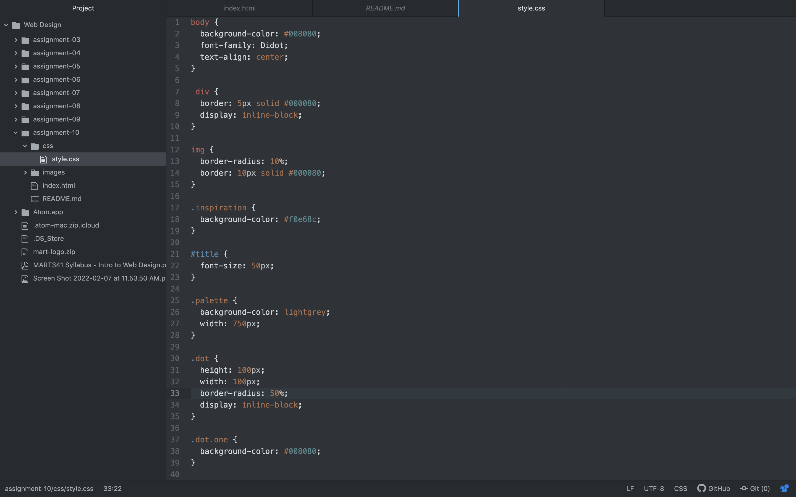

Universal style types style every element on a page, element selector's only style elements of a certain type, class selectors is more for elements that you want to have the same function, and id selectors lets you put rules on a specific element.
I chose the colors I did because they fit the starry night painting. I also thought they all went together well.
One challenge I had this week was getting my circles at the bottom of the page to work properly, but after about 10 minutes of reading through my code I realized I just forgot to put a semicolon at the end of the line of code.

