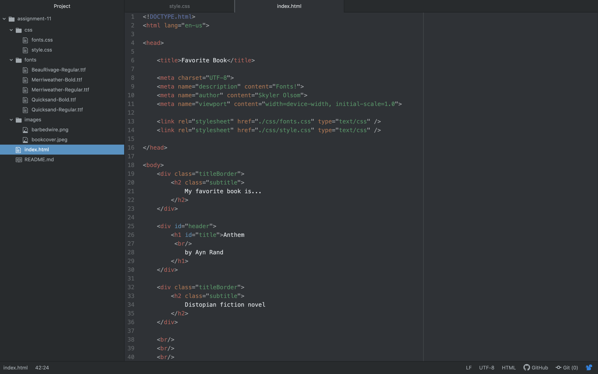

Typography is the science or art of text used on your website, and the ways you can design it differently to create a different effect.
They are important because if a font loads slowly, these could be the ones displayed on your website. If they don't work properly, it could affect the page layout.
A system font is a font already on your computer, a web font is a downloadable font online, and web-safe font is a font that can adapt to all browsers across different devices.

