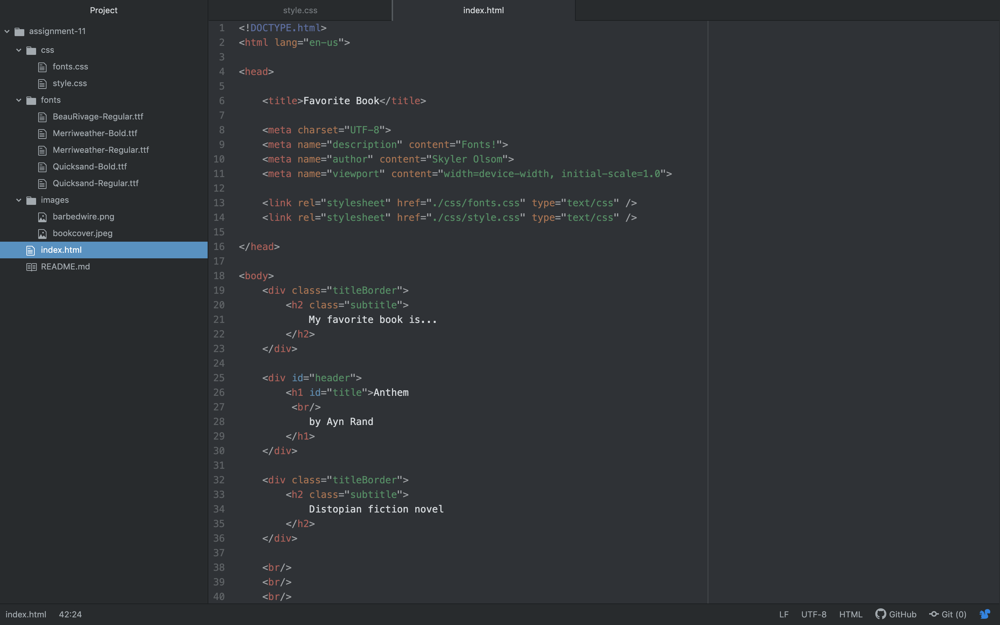

Borders are just a box surrounding something on your website, padding is the space between the content and the border, and margin is the space between different box elements
I didn't have many struggles this week. I think adding on to my already existing website from last week helped. 

