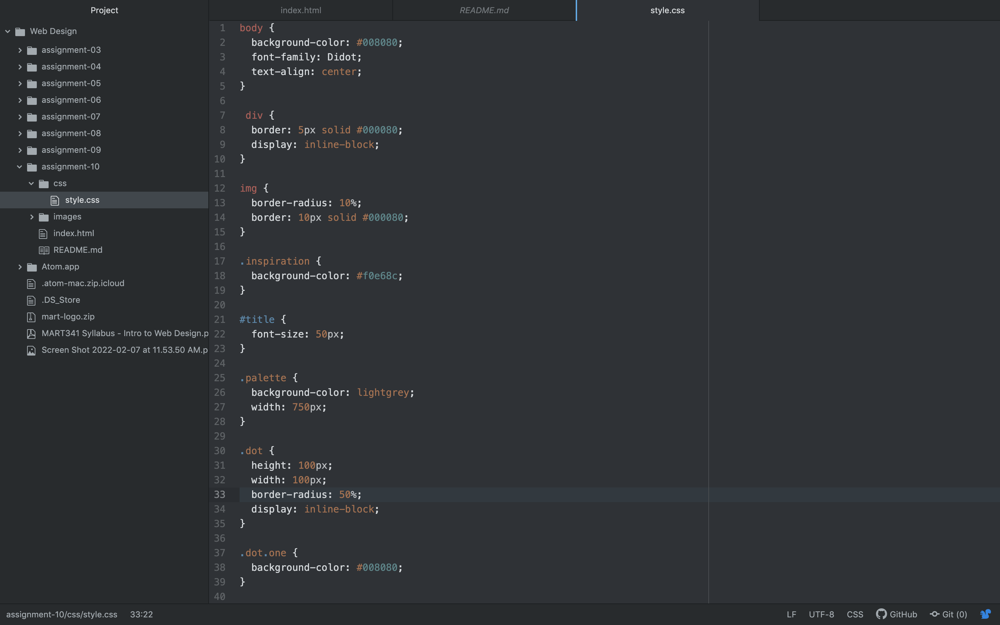

For my website, I am creating a place to view some of Vincent Van Gogh's most famous pieces of art, as well as include the color pallets of the art pieces. I'm hoping to just create a cool way to view the historic artwork.

Responsive web design is important because it allows your website to be viewed in a proper format no matter what device type your user uses to access it.

